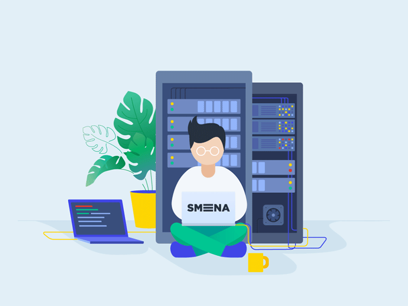

<!---
shreeya-07/shreeya-07 is a ✨ special ✨ repository because its `README.md` (this file) appears on your GitHub profile.
You can click the Preview link to take a look at your changes.
--->
Hi  I'm Shreeya Chattopadhyay
====================================================================================================================================

 

I am a competitive coder and a front end developer from India
-----------------------------------------------------------------------

- 🔭 I’m currently working on **Front-End Development**
  
- 🌍  I'm based in Bandel,Hooghly,West Bengal,India

- 🌱 I’m currently learning **DSA on C++ and Full stack Development**

- 📫 How to reach me **shreeyachattopadhyay@gmail.com**

- ⚡ Fun fact **I am funny 🙃**

## 🌐 Socials:

 

# 💻 Tech Stack:

          

 

# 📊 GitHub Stats:
 
 

## 🏆 GitHub Trophies

### ✍️ Random Dev Quote

### 🔝 Top Contributed Repo

---

<!-- Proudly created with GPRM ( https://gprm.itsvg.in ) -->
